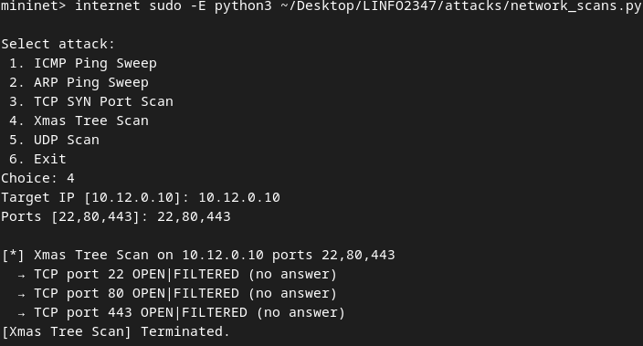
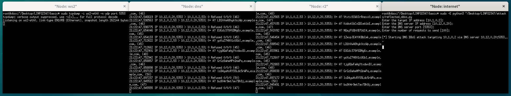
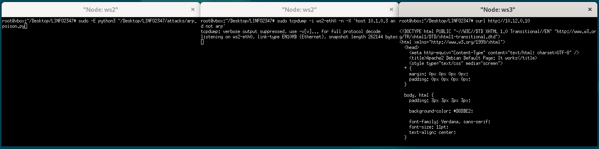
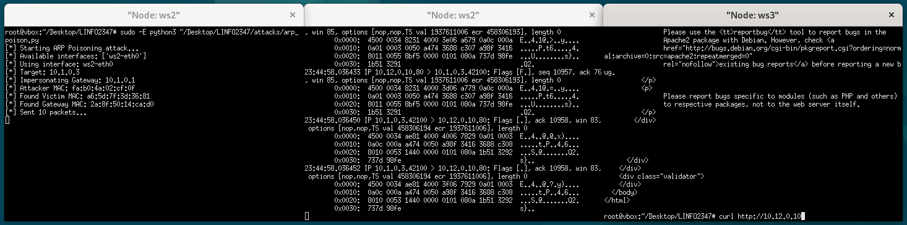

# LINFO2347: Network Attacks

Group 7: `MEUNIER Arnaud` & `HENNEN Cyril`

## Table of Contents

- [LINFO2347: Network Attacks](#linfo2347-network-attacks)
- [Setup](#setup)
  - [Installing required material (from Debian 12)](#installing-required-material-from-debian-12)
  - [Starting Mininet](#starting-mininet)
  - [Clearing Mininet](#clearing-mininet)
- [Basic Network Protection](#basic-network-protection)
- [Network scans (Xmas scan)](#network-scans-xmas-scan)
  - [Attack](#attack-1)
  - [Defense](#defense-1)
- [DNS Reflection (DoS)](#dns-reflection-dos)
  - [Attack](#attack-2)
  - [Defense](#defense-2)
- [ARP Poisoning (MITM)](#arp-poisoning-mitm)
  - [Attack](#attack-3)
  - [Defense](#defense-3)
- [SYN Flooding](#syn-flooding)
  - [Attack](#attack-4)
  - [Defense](#defense-4)

## Setup

### Installing required material (from Debian 12)

```bash
sudo apt install tcpdump -y
sudo apt install openssh-server -y
sudo systemctl enable ssh
sudo systemctl start ssh
sudo systemctl status ssh

sudo nano /etc/ssh/sshd_config # with appropriate settings like password/less login
sudo systemctl restart ssh

sudo apt install curl mininet python3-pip python3-setuptools apache2 dnsmasq openntpd vsftpd -y
sudo sed -i 's/^#port=/port=5353/' /etc/dnsmasq.conf
sudo sed -i 's/^port=.*/port=5353/' /etc/dnsmasq.conf
sudo systemctl restart dnsmasq

#(to check everything is ok)
sudo systemctl status dnsmasq.service

# Note dnsmasq is using port 5353 AND UNCOMENT the 'no-resolv' line #no-resolv (around line 70) in /etc/dnsmasq.conf
```

### Starting mininet

We have several topology available and can be launched as followed : 

1. Default topology (given by the teacher)
```
sudo python3 ./default_topo.py
```
2. Basic Network Protection
```
sudo python3 ./basic_network_protection/topo.py
```
3. Defense for Reflected DDOS
```
sudo python3 ./protections/reflected_ddos/reflected_topo.py
```
4. Defense for Syn Flood
```
sudo python3 ./protections/syn_flood/flood_topo.py
```
5. Defense for Xmas Scan
```
sudo python3 ./protections/xmas_scan/xmas_topo.py
```
6. Defense for ARP Poisoning
```
```
7. Defense for X
```
```

### Clearing mininet

To clear:

```
sudo mn -c
```

## Basic Network Protection

*The topology and the nftable configuration file can be found into the basic_network_protection folder*

The protection are written so that they have the best security possible while following this requirements :
- Workstations can send a ping and initiate a connection towards any other host (other workstations, DMZ servers, internet).
- DMZ servers cannot send any ping or initiate any connection. They can only respond to incoming connections.
- The Internet can send a ping or initiate a connection only towards DMZ servers. They cannot send a ping or initiate connections towards workstations.

#### Router R1
R1 is configured so that only trafic comming from the workstation and the answers to this trafic can go trought the router. This means that anything that was not initiated by the workstation is dropped, isolating the workstation network from the rest.

#### Router R2
R2 is configured so that :
- Trafic comming from the workstation can go trought
- Incomming trafic is only allowed if the destination is a DMZ server on their correct port or if the trafic is related to an already existing connection
- Internet can only ping the dmz server
- Any other trafic is dropped

#### DMZ servers (http, ntp, dns, ftp)
- DMZ servers only accept incomming trafic that follows the right port and protocol (tcp port 80 for http, udp port 5353 for dns, tcp port 20,21 for ftp, udp port 123 for ntp) or if the connection is already established or if the traffic is a ping request.
- The servers can only response to ping request or any established connection
- The DMZ cannot forward any traffic

Those configuration ensure that we reduce the attack surface as much as we can while meeting the requirement
## Network scans (Xmas scan)

### Attack

The Xmas scan works by sending a TCP packet with the **FIN**, **PSH** and **URG** flags set. And according to the RFC:
- If a port is closed, the host should **reply** with a **RST** (reset)
- If a port is open, there should be no response (same for filtered)

Purpose? Identifying hosts that are alive + indication that the network is not well protected/vulnerable.
In the example here port 443 is closed so the attacker knows it's probably running a HTTP server as well.

To launch an attack, with the mininet up and running:

```
mininet> internet sudo -E python3 ~/Desktop/LINFO2347/attacks/network_scans.py

Select attack:
 1. ICMP Ping Sweep
 2. ARP Ping Sweep
 3. TCP SYN Port Scan
 4. Xmas Tree Scan
 5. UDP Scan
 6. Exit
Choice: 4
Target IP [10.12.0.10]: 10.12.0.10
Ports [22,80,443]: 22,80,443

[*] Xmas Tree Scan on 10.12.0.10 ports 22,80,443
  → TCP port 22 OPEN|FILTERED (no answer)         
  → TCP port 80 OPEN|FILTERED (no answer)         
  → TCP port 443 CLOSED                           
[Xmas Tree Scan] Terminated.
```

So the internet did a Xmas scan on our HTTP server and found out that it's alive and it's likely a HTTP server.


### Defense

To defend this attack from hitting our DMZ, we need to add a rule on `r2` (DMZ <-> Internet)

```
iifname "r2-eth0" tcp flags & (fin|psh|urg) == (fin|psh|urg) drop
```

What it catches: TCP packets with the **FIN**, **PSH** and **URG** flags set.
What it does: it drops them!



## DNS Reflection (DoS)

### Attack

After mininet is up and running:

```
mininet> xterm internet ws2 r2 dns
```
`NOTE`: this attacks involves the victim (a workstation), the entrance router (r2), the dns server within the DMZ and the internet (the attacker)

From `ws2` (the victim) we want to capture the traffic and inspect the DoS occuring through the DNS:

```
root@vbox:~/Desktop/LINFO2347# tcpdump -i ws2-eth0 -n udp port 5353 -w /tmp/ws2-dns-reflect-capture.pcap
```

Now from `internet` we want to then launch the attack:

```
root@vbox:~/Desktop/LINFO2347# python3 ~/Desktop/LINFO2347/attacks/reflected_ddos.py
```

This is a screenshot of the attack with **zero protection enabled**:


`NOTE`: We can see the workstation being targetted by our own DNS server, with the UDP packets coming through both r2 and r1.

*Optionally* to check the DNS IN/OUT traffic to confirm/debug:

```
mininet> xterm dns
```

For incoming: 

```
tcpdump -i dns-eth0 -n 'udp and src host 10.1.0.2 and dst port 5353'
```

For outgoing:

```
tcpdump -i dns-eth0 -n 'udp and dst host 10.1.0.2 and src port 5353'
```

### Defense

For the defense, they are both located on the two routers in `/basic/basic_r2.nft` and `/basic/basic_r1.nft`.

On `r2` (also known as the main entrance):

```
iifname "r2-eth0" ip saddr 10.1.0.0/24 drop;
iifname "r2-eth0" ip saddr 10.12.0.0/24 drop;
```

What it catches: Any inbound packet on the internet interface (r2-eth0) that claims to come from your internal LAN (10.1.0.0/24) or DMZ (10.12.0.0/24).

This is a screenshot of the attack with **full protection enabled**:


But `r1` also protects our `ws` from unsolicited DNS replies.

An attacker on the Internet forges a query with src=10.1.0.2 (ws2). That forged query never hit r1 in the first place (it goes straight to r2 -> DMZ).

The DNS server’s reply comes back to r1 with src=10.12.0.20 and dst=10.1.0.2.

It doesn't blcok legitimate requests from `ws2`.
ws2 (10.1.0.2) sends a DNS query -> r1.
On r1, ip saddr 10.1.0.0/24 accept matches immediately, so the query is forwarded onward into the DMZ

This is a screenshot of the attack with **only r1 protection enabled**:



## ARP Poisoning (MITM)

### Attack

For this attack we need `ws2` and `ws3`. 

We first start by opening 3 `xterm` terminals from the Mininet:

```
mininet> xterm ws2 ws2 ws3
```

On one `ws2` terminal we listen (MITM):
```
ws2> sudo tcpdump -i ws2-eth0 -n -X 'host 10.1.0.3 and not arp'
```

On the other `ws2` terminal we launch the attack
```
ws2> sudo -E python3 ~/Desktop/LINFO2347/attacks/arp_poison.py
```

Then on the victim we simply try to reach one of the service in the DMZ for instance the `http` server (`apache2`):
```
ws3> curl http://10.12.0.10
```

Before the attack:



After the attack:




### Defense

After spending quite a few hours on the question, we couldn't come up with `nftables` rules defending against our own script. We could theoretically dumb down the attack/arp poisoning (by not targeting the router as well) but dual-sided poisoning is needed for a full MITM.

- Dynamic discovery + forged-but-accurate packets = can’t be told apart by simple IP/MAC rules.
- High-frequency flooding, rate limiting can't counter the attack
- Dual-sided poisoning means full MITM, not just cache pollution.

So the practical idea to defend against such nasty arp poisoning is to:

1. Either use static (hardcoded) arp entries (not that great but surely effective way to deal with arp poison).

2. `nftables` are not the best way to counter arp cache poison, inherently it's the same hardcoding of mac addresses but inherently how to know who is what if the packets are forged and sent out (with scapy we are at the lowest level possible forging layer 2 packets). Since the attacker can send packets with the MAC address of the router `nftables` are too weak and can be bypassed by the attack script we wrote (basically we couldn't figure out a way to counter our own attack with `ntfables` and the solution can't be simple when you take into account L2 source spoofing).

3. **Use ipv6 but this seems to be outside the scope of the project, but no one should still be using ipv4 arp**

Here's our very simplistic `static arp` using `arp` directly:

```
mininet> r1 sudo ~/Desktop/LINFO2347/basic/set_static_arp.sh
Running on Router (r1) (10.1.0.1). Setting static ARP for 10.1.0.3.
Executing: sudo arp -s 10.1.0.3 e2:b2:14:9d:90:5c -i r1-eth0
Verifying ARP entry:
10.1.0.3                 ether   e2:b2:14:9d:90:5c   CM                    r1-eth0
Static ARP entry set successfully.


mininet> ws3 sudo ~/Desktop/LINFO2347/basic/set_static_arp.sh
Running on Workstation (ws3) (10.1.0.3). Setting static ARP for 10.1.0.1.
Executing: sudo arp -s 10.1.0.1 ca:31:e1:f5:1d:01 -i ws3-eth0
Verifying ARP entry:
10.1.0.1                 ether   ca:31:e1:f5:1d:01   CM                    ws3-eth0
Static ARP entry set successfully.
```

With this "defense" script we cancel out arp poisoning completely on ws3 for instance. What the whole script does is basically run these commands:

```
mininet> ws3 sudo arp -s 10.1.0.1 ca:31:e1:f5:1d:01 -i ws3-eth0

mininet> r1 sudo arp -s 10.1.0.3 e2:b2:14:9d:90:5c -i r1-eth0
```

## SYN Flooding

### Attack

### Defense

To defend see the `nftable` rule file in `/basic/syn_flood.nft`. They can be activated in the topology directly in `/basic/topo_basic.py`
