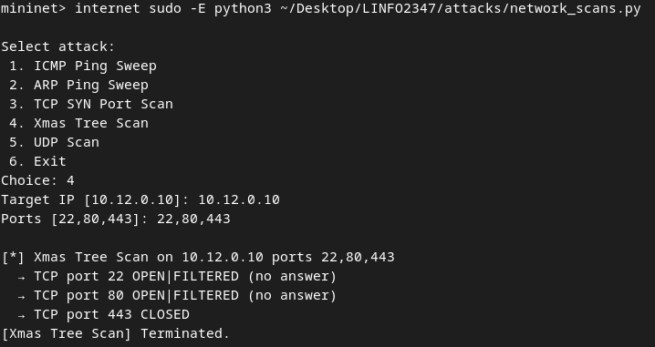

# LINFO2347: Network Attacks Project

This document provides an overview of the project structure, setup instructions, details about the implemented attacks, how to launch them, and the corresponding defenses using custom topologies. Additionally, it explains the functionality of the basic network protection.

---

## Project Structure

The project is organized into the following folders and files:

```
LINFO2347/
├── attacks/
│   ├── arp_poison.py          # ARP poisoning attack script
│   ├── network_scans.py       # Various network scanning attacks
│   ├── reflected_ddos.py      # DNS reflection attack script
│   ├── syn_flood.py           # SYN flooding attack script
├── basic_network_protection/
│   ├── topo.py                # Mininet topology for basic network protection
│   ├── basic_r1.nft           # Firewall rules for Router R1
│   ├── basic_r2.nft           # Firewall rules for Router R2
│   ├── basic_http.nft         # Firewall rules for HTTP server
│   ├── basic_dns.nft          # Firewall rules for DNS server
│   ├── basic_ntp.nft          # Firewall rules for NTP server
│   ├── basic_ftp.nft          # Firewall rules for FTP server
├── protections/
│   ├── xmas_scan/             # Xmas scan defense topology and rules
│   ├── syn_flood/             # SYN flood defense topology and rules
│   ├── reflected_ddos/        # DNS reflection defense topology and rules
├── README.md                  # Main documentation
├── statement.md               # Project statement
├── default_topo.py            # Default Mininet topology
```

---

## Setup Instructions

This project is designed to run on the VM provided in the course (V2) but we included instructions to run it on a fresh Debian 12 installation. The project uses Mininet for network simulation and `nftables` for firewall rules.

### Installing Required Tools (Debian 12)

Run the following commands to install the necessary tools if you are using a fresh Debian 12 installation:

```bash
sudo apt install tcpdump -y
sudo apt install openssh-server -y
sudo systemctl enable ssh
sudo systemctl start ssh
sudo apt install curl mininet python3-pip python3-setuptools apache2 dnsmasq openntpd vsftpd -y
sudo sed -i 's/^#port=/port=5353/' /etc/dnsmasq.conf
sudo sed -i 's/^port=.*/port=5353/' /etc/dnsmasq.conf
sudo systemctl restart dnsmasq
```

### Lauching the Topology

The project includes several topologies. Launching them include the application of the defenses mechanisms to the network and worstations.
All of them are based on the default topology given in the course with the default one being unmodified. 

1. **Default Topology**:
    Recommanded if you want to test the attacks in a defensless environment.
```bash
sudo python3 ./default_topo.py
```
2. **Basic Network Protection**:
```bash
sudo python3 ./basic_network_protection/topo.py
```
3. **Defense for Xmas Scan**:
```bash
sudo python3 ./protections/xmas_scan/xmas_topo.py
```
4. **Defense for Reflected DDoS**:
```bash
sudo python3 ./protections/reflected_ddos/reflected_topo.py
```
5. **Defense for SYN Flood**:
```bash
sudo python3 ./protections/syn_flood/flood_topo.py
```
---

## Basic Network Protection

The basic network protection ensures the topology mimics a secure enterprise network by implementing firewall rules using `nftables`. These rules enforce the following policies:

1. **Workstations (LAN)**:
   - Can send pings and initiate connections to any other host (workstations, DMZ servers, or the Internet).
   - Responses to their requests are allowed.
   - Cannot receive unsolicited pings or connections comming outside their LAN.

2. **DMZ Servers**:
   - Cannot initiate any connections or send pings.
   - Can only respond to incoming/established connections on specific ports (e.g., HTTP on port 80, DNS on port 5353, etc.) and ping requests.
   - Cannot forward traffic.

3. **Internet**:
   - Can only send pings or initiate connections to DMZ servers.
   - Cannot send pings or initiate connections to workstations.

These rules reduce the attack surface while maintaining normal network functionality.

### Launching the Basic Network Protection

Start the basic network protection topology and defense with the following command:
```bash
sudo python3 ./basic_network_protection/topo.py
```

---

## Attacks and Defenses

### 1. Network Scans (Xmas Scan)

#### Attack
The Xmas scan sends TCP packets with the **FIN**, **PSH**, and **URG** flags set. Open ports do not respond, while closed ports reply with a **RST**.

**Steps to Launch**:
1. Start the default topology:
```bash
sudo python3 ./default_topo.py
```
2. From the `internet` host, run the Xmas scan:
```bash
mininet> internet sudo -E python3 ~/Desktop/LINFO2347/attacks/network_scans.py
```
   Select option `4` (Xmas Tree Scan) and provide the target IP and ports.

*Note: The attack can be launched from any host, but the `internet` host is used for demonstration purposes.*

**Example Output**:



#### Defense
To improve the defenses against Xmas scans, add a rule on your hosts to drop packets with the **FIN**, **PSH**, and **URG** flags set:
```nft
tcp flags & (fin|psh|urg) == (fin|psh|urg) drop
```
**Launch the defense**:
```bash
sudo python3 ./protections/xmas_scan/xmas_topo.py
```
*Note: this will launch a new topology including the basic_network_protection and the added defenses.*

**Defense summary**:
| Attacker-Victim | How |
|------|-----|
| ws -> ws | ws and r1 nftable will drop the packets with the added rule |
| ws -> dmz | dmz, r1 and r2 will drop the packets with the added rule |
| ws -> internet | r1 and r2 will drop the packets with the added rule |
| dmz -> ws | dmz (attacker) cannot initiate connections + r1 and r2 will drop the packets with the added rule |
| dmz -> dmz | dmz (attacker) cannot initiate connections + dmz (victim), r1 and r2 will drop the packets with the added rule |
| dmz -> internet | dmz cannot initiate connections + r1 and r2 will drop the packets with the added rule |
| internet -> ws | r2 will drop the packets because invalid destination ip|
| internet -> dmz | dmz, r2 will drop the packets with the added rule |

---

### 2. DNS Reflection (DoS)

#### Attack
A DNS reflection attack uses a DNS server to amplify traffic towards a victim by sending spoofed DNS queries.

**Steps to Launch**:
1. Start the default topology:
```bash
sudo python3 ./default_topo.py
```
2. From the `internet` host, run the DNS reflection attack:
```bash
mininet> internet sudo -E python3 ~/Desktop/LINFO2347/attacks/reflected_ddos.py
```
*Note: The attack can be launched from any host, but the `internet` host is used for demonstration purposes.*

**Example Output**:


*Note: We can see the workstation being targetted by our own DNS server, with the UDP packets coming through both r2 and r1.*

#### Defense
To improve the defenses against DNS reflection attacks, add rules on `R2`to drop packets from the Internet claiming to originate from internal IP ranges:
```nft
iifname "r2-eth0" ip saddr 10.1.0.0/24 drop;
iifname "r2-eth0" ip saddr 10.12.0.0/24 drop;
```

**Launch the defense**:
```bash
sudo python3 ./protections/reflected_ddos/reflected_topo.py
```
*Note: this will launch a new topology including the basic_network_protection and the added defenses.*

**Example Output**:


**Defense summary**:
| Attacker-Victim | How |
|------|-----|
| ws -> ws | r1 will drop the dns response as it is not an established connection |
| ws -> dmz | dmz will drop the dns response as it doesn't respect the destination port rule (ie: response will not be on port 80 for http server)|
| ws -> internet | Works but doesn't affect our network directly |
| dmz -> ws | dmz cannot initiate connections + r1 will drop the dns response as it is not an established connection  |
| dmz -> dmz | dmz (attacker) cannot initiate connections + dmz will drop the dns response as it doesn't respect the destination port rule (ie: response will not be on port 80 for http server) |
| dmz -> internet | dmz cannot initiate connections |
| internet -> ws | r2 will drop the packets with the added rule |
| internet -> dmz | r2 will drop the packets with the added rule |

---

### 3. ARP Poisoning (MITM)

#### Attack
ARP poisoning allows an attacker to intercept traffic between two devices by sending forged ARP packets.

**Steps to Launch**:
1. Start the default topology:
   ```bash
   sudo python3 ./default_topo.py
   ```
2. Open terminals for `ws2` (attacker) and `ws3` (victim):
   ```bash
   mininet> xterm ws2 ws3
   ```
3. On `ws2`, launch the ARP poisoning attack:
   ```bash
   ws2> sudo -E python3 ~/Desktop/LINFO2347/attacks/arp_poison.py
   ```
4. On `ws3`, try accessing a service (e.g., HTTP server):
   ```bash
   ws3> curl http://10.12.0.10
   ```

#### Defense
Defending against ARP poisoning requires static ARP entries:
1. On `r1`, set a static ARP entry for `ws3`:
   ```bash
   sudo arp -s 10.1.0.3 <ws3-mac-address> -i r1-eth0
   ```
2. On `ws3`, set a static ARP entry for `r1`:
   ```bash
   sudo arp -s 10.1.0.1 <r1-mac-address> -i ws3-eth0
   ```

---

### 4. SYN Flooding (DoS)

#### Attack
A SYN flood attack overwhelms a target by sending numerous TCP connection requests without completing the handshake.

**Steps to Launch**:
1. Start the default topology:
   ```bash
   sudo python3 ./default_topo.py
   ```
2. From `ws2`, launch the SYN flood attack:
   ```bash
   ws2> sudo -E python3 ~/Desktop/LINFO2347/attacks/syn_flood.py
   ```
   Provide the target IP, port, and number of requests.

#### Defense
To defend against SYN flooding, use rate limiting on TCP connection requests:
```nft
tcp flags syn ct state new limit rate 75/second burst 25 packets accept;
tcp flags syn ct state new drop;
```
**Steps to Apply**:
```bash
sudo nft -f protections/syn_flood/flood_http.nft
```